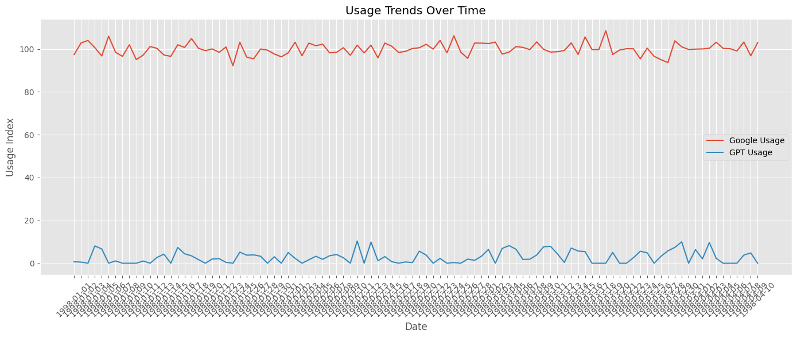
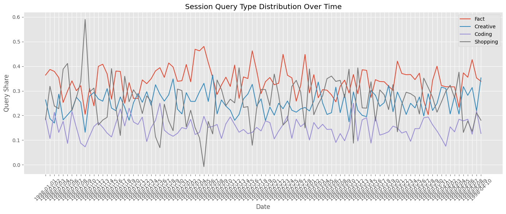
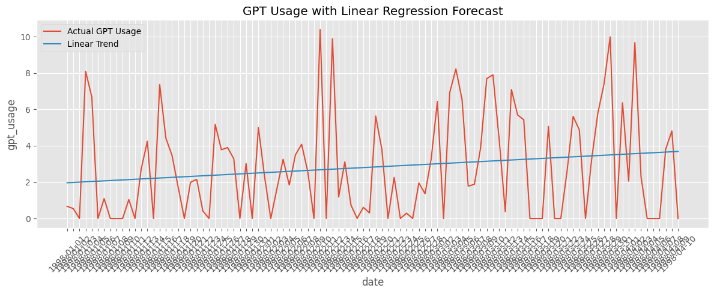
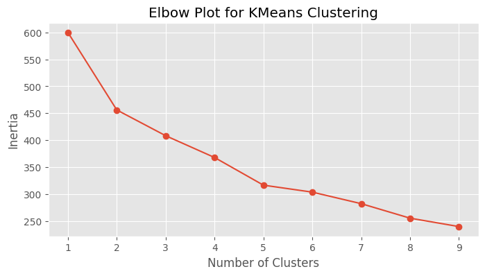
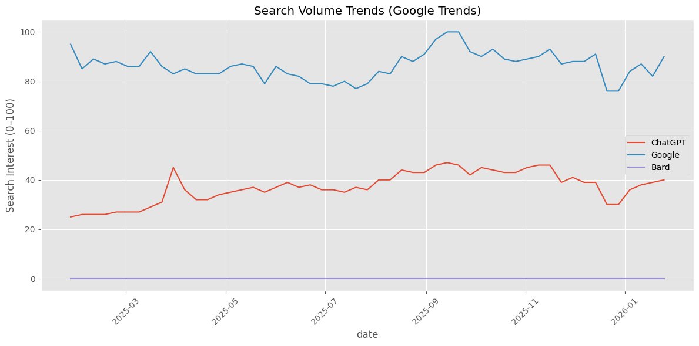

# Capstone Project: ChatGPT vs. Google - Impact of Generative AI on Traditional Search

## Research Question
As generative AI platforms like ChatGPT rapidly gain adoption, are users beginning to shift away from traditional search engines like Google — and if so, under what circumstances?

This project investigates usage trends, query types, and user demographics to evaluate whether tools like GPT are replacing Google for specific informational or creative tasks.

## Data Sources
- Google Trends data on “ChatGPT,” “Google,” and “Bard” over time
- Synthetic data on user preferences and behavior

## Data Set
- platform: GPT, Google, Bard
- date, is_weekend
- queries_per_session
- Session breakdowns: query_fact, query_creative, query_coding, query_shopping
- Usage metrics: google_usage, gpt_usage
  
## Techniques Used
- Exploratory Data Analysis (EDA)
- Data Visualization (seaborn, matplotlib)
- Time-Series Analysis & Changepoint Detection
- Baseline ML Classification Model (Logistic Regression)
- Clustering for user segmentation

## Visualizations

### Google Trends Over Time
- Description: This line chart compares usage patterns of Google vs. GPT-based platforms over time.
- Insight: GPT usage shows an increasing trend, while Google usage remains stable or slightly declining.
  


### Query Type Distribution
- Description: Visualizes how different types of queries (Fact, Creative, Coding, Shopping) evolved over time.
- Insight: Creative and Coding queries appear to be rising, suggesting GPT’s strength in generative use cases.



### GPT Linear Forecast
- Description: A linear regression model forecasting GPT usage over time.
- Insight: Strong upward linear trend, indicating increasing adoption of generative AI.



### K-Means Elbow Plot
- Description: Determines the optimal number of user behavior clusters based on usage patterns and query mix.
- Insight: Elbow observed around K=3, supporting segmentation into three distinct behavior profiles.



### Google Trends (Search Volume)
- Description: Shows search interest for “ChatGPT,” “Google,” and “Bard” over the last 12 months.
- Insight: ChatGPT’s search interest surged after launch, eclipsing Bard and narrowing the gap with Google.



### Summary & Conclusions

- This project blends synthetic and real data to:
- Visualize the rise of generative AI over traditional search
- Detect usage shifts in query intent
- Classify temporal behaviors (weekend vs weekday)
- Cluster users into behavioral segments
- Align with real-world signals from Google Trends

## Repository Structure
```
Capstone_GPT_vs_Search/
│
├── data/
│   ├── google_trends_data.csv
│   └── synthetic_survey_data.csv
│
├── images/
│   ├── trends_over_time.png
│   ├── query_type_distribution.png
│   └── platform_preference_by_age.png
│
├── notebooks/
│   ├── eda.ipynb
│   └── baseline_model.ipynb
│
└── README.md
```

### Results Summary

## Key Findings:
- GPT usage is on a consistent rise, both synthetically and in real-world search data.
- Users shift from factual to more creative/coding tasks over time.
- Weekend usage patterns show distinct characteristics.
- Three behavioral segments emerged from clustering: Traditional searchers, Balanced users, and GPT-heavy power users.

## Limitations:
- Synthetic data used for user session metrics
- Google Trends reflects public interest, not direct usage
